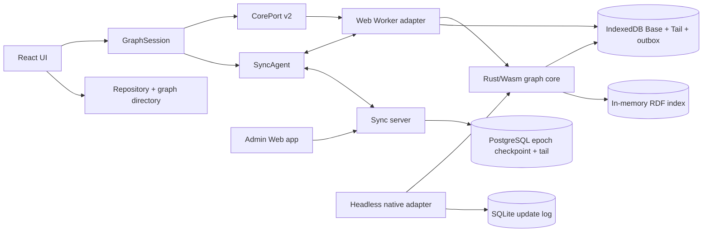

# Neoseq Architecture

## Purpose and Current Boundary

Neoseq is a local-first outliner. Pages and tags are first-class outline owners:
each owns an ordered tree of Markdown blocks, while journals provide the primary
daily capture surface. Typed properties add task and query behavior without
introducing feature-specific storage shapes.

The implemented product is a local-first Web client: React calls a Rust/Wasm
core in a Web Worker, IndexedDB stores a bounded Loro Base+Tail and remote
outbox, and an in-memory RDF index serves graph search and read-only SPARQL.
Remote graphs synchronize through an authenticated Rust WebSocket service and
durable PostgreSQL update log. A headless native adapter verifies the core and
storage contracts with SQLite; native shells and release infrastructure remain
in [`steps/`](steps/).

This document is the repository-wide architectural source of truth.
Component-level detail lives under [`architectures/`](architectures/).
[`DESIGN.md`](DESIGN.md) defines the repository-wide design architecture, with
focused design boundaries under [`designs/`](designs/).

## Drivers

- Local graphs work without a network connection.
- Rust owns domain rules, CRDT mutation, indexing, and query semantics.
- Platform code implements storage and binding concerns without domain policy.
- Canonical graph data remains portable Loro state; every index is disposable.
- Graph archives are copy-only: every import creates an independent graph
  identity in the selected repository and never overwrites or merges an
  existing graph.
- A remote replica becomes writable only after it has installed a Base whose
  bytes and history epoch the server has accepted. Full-history CRDT exports are
  never used to bootstrap an independently created server document.
- User queries cannot access the filesystem, network, processes, or another graph.
- Presentation preferences and localization never mutate graph semantics.
- devenv provides reproducible development, build, and verification environments.
- Architecture remains no larger than current requirements; compatibility is
  added only for persisted schemas that the product explicitly supports.

## Current System



The browser Worker owns the Wasm core and IndexedDB interaction. Main-thread
components receive immutable DTOs and semantic events; they do not receive Loro
containers or access persistence directly. The native adapter is a parity and
persistence test boundary, not a shipped application shell.

## Component Boundaries

- `domain` owns IDs, property definitions and values, commands, and invariants.
  It has no dependency on Loro, storage, transport, or UI frameworks.
- `graph-core` owns one graph runtime, Loro projection, transactions, local
  history, persistence coordination, remote-update import, and events.
- `graph-archive` owns the versioned, bounded portable container and manifest;
  it does not choose repository identity or interpret graph semantics.
- `query` owns Loro-to-RDF projection, indexing, constrained SPARQL planning,
  and budgeted read-only execution. It cannot mutate canonical state.
- `platform-web` exposes the product Wasm boundary.
- `platform-native` supplies the headless CorePort and SQLite adapter used for
  parity and recovery verification.
- `apps/client` owns interaction, navigation, browser-local preferences,
  localization, error presentation, responsive UI, and the query builder that
  authors SPARQL for the profile `query` executes.
- `apps/dashboard` is a separately built operational Web app for server account and
  session administration. It does not load the graph core or graph data.
- `sync-protocol` owns the versioned, size-bounded binary envelope shared by
  sync replicas and the service.
- `neoseq-server` owns authentication and membership seams, durable update relay,
  disposable graph rooms, presence, and operational endpoints. It does not
  own graph semantics or a relational graph projection; see
  [server architecture](architectures/server.md).
- `neoseq-appliance` owns single-container process supervision, embedded
  PostgreSQL lifecycle, ingress publication, health, backup, and restore. It
  contains no product or graph semantics; see
  [appliance architecture](architectures/appliance.md).

Detailed contracts:

- [Core and domain](architectures/core.md)
- [CRDT data and local persistence](architectures/data.md)
- [Graph archives](architectures/graph-archive.md)
- [Property fields](architectures/properties.md)
- [Query and derived index](architectures/query.md)
- [Client application](architectures/clients.md)
- [Repository-qualified graphs](architectures/repositories.md)
- [Block Markdown rendering](architectures/markdown-rendering.md)
- [Inline page references](architectures/page-references.md)
- [Outline clipboard](architectures/clipboard.md)
- [Undo/redo navigation](architectures/history-navigation.md)
- [Property command picker](architectures/property-command-picker.md)
- [Internationalization](architectures/i18n.md)
- [Build and verification](architectures/build.md)
- [Synchronization server](architectures/server.md)
- [All-in-one appliance](architectures/appliance.md)

## CorePort

The asynchronous CorePort v2 contract has seven operations. Every graph locator
contains a client repository ID and the graph ID assigned within that
repository:

```text
open_graph(locator) -> graph_handle + graph_summary
execute(graph_handle, command) -> command_result
read(graph_handle) -> graph_summary
read_outline(graph_handle, page_or_tag_owner) -> outline_view
query(graph_handle, sparql_request) -> select_result | ask_result
subscribe(graph_handle, cursor) -> graph_events
close_graph(graph_handle)
```

[`contracts/core-port.json`](contracts/core-port.json) generates the Rust and
TypeScript DTOs, as [`contracts/graph-schema.json`](contracts/graph-schema.json)
and [`contracts/sync-protocol.json`](contracts/sync-protocol.json) generate the
document-schema version and the sync protocol version for both languages. [`fixtures/core-port/current.json`](fixtures/core-port/current.json)
is the shared adapter corpus. Large CRDT and archive payloads use transferable
binary buffers; ordinary values use generated DTOs. Adapter-only graph listing,
deletion, copy import/export, retry, and test controls are deliberately outside
CorePort.

## Data and Consistency

- One graph is one Loro document and one independent storage and future sync unit.
- Pages and tags use stable IDs. Each owns one owner-local movable block tree;
  structure never moves across owners, while clipboard transfer is a copy.
- Page roots and blocks share collaborative content, a typed property bag, and
  explicit tag references. Block content may contain stable page-reference
  atoms whose current-title source is a projection. A tag outline does not
  implicitly tag its blocks.
- Page and tag names are unique in separate normalized graph-wide namespaces.
- New journal IDs derive deterministically from graph ID and local date. A
  portable copy retains existing journal IDs and resolves them by semantic date.
- A property field is either an atomic single/set or a schema-owned CRDT
  document. Empty atomic fields are first-class; repeated values and document
  children have stable identities and independent merge granularity.
- [`contracts/property-registry.json`](contracts/property-registry.json) is the
  current v9 registry shared by core and client. Property keys have exactly two
  levels: application-defined `builtin.<name>` and graph-level user-defined
  `user.<name>`. Unknown built-ins remain readable but core-managed; unknown user
  properties remain readable and editable.
- Deleting a page is a soft delete and page references remain resolvable as
  tombstones. Deleting a tag soft-deletes its record and atomically detaches
  that tag from every page root and block in any outline; copied default-property values remain.
- A user intent that needs several ordinary commands uses one bounded, flat
  batch. The core preflights its ordered steps on a fork, then commits one CRDT
  transaction, history entry, durable update, and semantic event.
- Shared saved-view definitions and the query builder's plan behind a built
  query are graph data. RDF triples, query results and evaluation plans, private
  presentation preferences, UI selection, and connection state are derived,
  user-scoped, or ephemeral and never canonical graph data.
- Builder-authored block results may expose direct content, property, and tag
  controls. Those controls resolve the row's stable entity reference and submit
  ordinary domain commands; the derived query index remains a read-only
  selection path and is never a mutation API.
- Editable block projections share one native input and completion kernel while
  their surfaces retain separate structural controllers. Contextual commands
  resolve the most recently focused block target before falling back to a page.

One user intent becomes one prepared domain command, one Loro transaction, one
local undo item, one durable update, and one semantic event. Preparation validates
the complete change and fixes its structural plan and history metadata before
mutation; later stages consume that same plan rather than deriving it again. An
update is reported saved only after the repository append commits; a failed append
holds the exact bytes for retry and blocks additional mutation.

## Local Write Flow

1. The UI submits a domain command with an idempotency key.
2. `GraphRuntime` validates and applies one Loro transaction.
3. The repository appends the binary update durably.
4. The RDF index publishes a complete revision for the new Loro frontier.
5. Subscribers receive semantic graph and durability events.

For a remote graph, the local update and its outbox record commit in the same
IndexedDB transaction. `SyncAgent` sends outbox entries in sequence, removes
them only after a durable server acknowledgement, and imports validated remote
bytes through the same Worker/core projection path. Network availability never
changes the local save contract.

Remote archive import is a prepare/commit/install flow. The Worker validates and
clones the archive without publishing it; authenticated HTTP creation validates
and commits that checkpoint as the server's initial Base; only then does the
browser atomically install the exact accepted bytes and mark their provenance.
A newly opened remote replica without that marker is read-only until WebSocket
`Welcome` replaces it with the authoritative server checkpoint.

Persistence is Base+Tail, not an unbounded event archive. Local graphs install
a shallow Loro checkpoint after 128 uncompacted tail records or 512 KiB. The
current and prior Base remain recoverable for one generation; covered Tail rows
are reclaimed when the next Base makes that prior generation obsolete. Each
durable replica keeps one stable Loro peer ID.
Remote history is reclaimed only when the server rotates a `history_epoch`;
clients atomically adopt the new Base and rebase any unacknowledged local intent
into one referenced Tail/outbox record.

## Security and Privacy

- Local graphs make no network requests.
- Query execution is confined to the current graph's derived index. Dataset
  selection, federation, SPARQL Update, and other I/O-capable forms are rejected.
- Raw internal errors stay behind typed stable error codes; the UI localizes
  safe messages.
- Remote endpoints require TLS, authenticated membership, and limits on
  untrusted CRDT frames before acceptance.
- People authenticate with a username and password once. The server stores only
  Argon2id verifiers and exchanges a successful login for a bounded, revocable,
  purpose-specific opaque session; passwords never enter graph or sync data.
- The v3 remote protocol is not end-to-end encrypted; E2EE requires
  a separate opaque-log and key-management design.

## Repository Shape

```text
crates/domain/             pure domain model and commands
crates/graph-archive/      bounded portable archive container and manifest
crates/graph-core/         Loro runtime and application services
crates/query/              RDF projection and SPARQL execution
crates/platform-web/       Wasm bindings
crates/platform-native/    headless SQLite/CorePort adapter
crates/sync-protocol/      versioned binary synchronization messages
crates/neoseq-server/      PostgreSQL-backed WebSocket synchronization service
crates/neoseq-appliance/   all-in-one process and database lifecycle controller
apps/client/               React UI, Worker, IndexedDB, and browser tests
apps/dashboard/            standalone neoseq-server administration Web app
examples/compose.yaml      operator-facing Docker Compose example
contracts/                 current source contracts
fixtures/                  current cross-adapter corpus
architectures/             component architecture documents
designs/                   focused design architecture documents
steps/                     future delivery plan
```

Dependencies point inward: platform and delivery code depend on the core and
domain, never the reverse.

## Evolution Rules

- Change a current contract and its generators, consumers, tests, and
  architecture together.
- A version two languages must agree on is declared once in `contracts/` and
  generated into every language that reads it. Rust and TypeScript never mirror
  such a version by hand.
- Add compatibility fixtures only when the product genuinely supports more
  than one deployed contract or persisted schema.
- Before the first supported release, persisted adapters, wire messages, and
  graph documents accept only their current declared versions.
- New platforms implement existing ports rather than forking domain behavior.
- New metadata features use the property registry. New identity or relationship
  semantics require an explicit structural design.
- Derived-index format changes rebuild from Loro rather than migrate user data.
- Architecture-affecting code changes update this document and the relevant
  component document in the same change.
