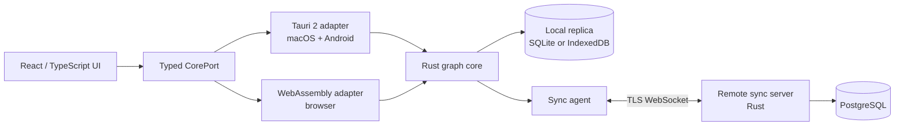

# NeoSeq Architecture

## Purpose

NeoSeq is a local-first, outliner-based note-taking application. A graph
contains pages; a page contains ordered root blocks; and every block may contain
ordered child blocks. Daily journal pages are the primary capture surface. Each
block has collaborative Markdown text. Every other user-visible semantic,
including page-backed tags, queries, and task fields, is represented as a typed
property. Users can query blocks and pages with a safe declarative language.

This document is the architectural source of truth. Component-level detail lives
under [`architectures/`](architectures/).

## Architectural Drivers

- The product must work offline and support local-only graphs.
- Remote graphs must converge through Loro CRDT updates and synchronize in real
  time when connected.
- One Rust core must own domain rules, graph mutation, indexing, and query
  semantics on web, macOS, and Android.
- The UI should be shared across platforms without making the domain depend on a
  webview or JavaScript runtime.
- Development and builds must be reproducible through Nix, subject to Apple
  signing and SDK constraints.
- User-authored queries must be expressive without gaining filesystem, network,
  or process capabilities.
- All non-Markdown features must use one property model instead of adding
  feature-specific fields or CRDT containers.

## System Context



The UI calls the same versioned `CorePort` contract on every platform. Native
clients invoke the Rust core in-process through Tauri commands. The browser
loads the same core compiled to WebAssembly. A local graph stops at durable
local storage. A remote graph uses the identical local replica plus a sync
agent.

## Components

- `domain` owns IDs, uniform property types/definitions, commands, invariants,
  journal rules, and tag-default rules. It does not know Loro, storage,
  transport, or UI.
- `graph-core` owns the graph runtime, Loro projection, transactions, undo, and
  events. It does not know platform APIs or authentication.
- `query` owns parsing, planning, indexes, and budgeted execution. It cannot
  mutate CRDT state or call the server.
- `platform` owns native/WebAssembly bindings plus persistence and transport
  adapters. It contains no domain decisions.
- `app-ui` owns editing interaction, navigation, and responsive presentation. It
  does not hold canonical graph state.
- `sync-server` owns authentication boundaries, graph authorization, durable
  update relay, and compaction. It does not interpret notes or execute queries.

Detailed contracts are in:

- [Core and domain](architectures/core.md)
- [CRDT data model and persistence](architectures/data.md)
- [Query engine](architectures/query.md)
- [Client applications](architectures/clients.md)
- [Remote synchronization server](architectures/server.md)
- [Build, delivery, and verification](architectures/build.md)

## Core Runtime Contract

One `GraphRuntime` owns each open graph. It serializes commands so a user action
is one Loro transaction, persists the resulting update, updates derived indexes,
and then emits a typed event. Remote imports enter through the same runtime and
update the same projections. Reads use immutable DTOs; callers never receive
Loro containers.

The boundary is asynchronous and versioned:

```text
open_graph(locator) -> graph_handle + initial_view
execute(graph_handle, command) -> command_result
query(graph_handle, source, parameters) -> result_set
subscribe(graph_handle, cursor) -> graph_events
close_graph(graph_handle)
```

Large text edits and synchronization payloads use binary buffers rather than
JSON. All other boundary values are generated from a shared schema to keep
TypeScript, native, and WebAssembly adapters compatible.

## Data and Consistency Model

- A graph is one Loro document and one independent synchronization/security
  unit.
- Pages are stored by stable `PageId`; blocks are nodes in one ordered, movable
  Loro tree.
- Block Markdown is the only user content outside the uniform property model.
  Page titles/kinds, journal dates, tags, query programs, and task state,
  schedule, deadline, and priority are all properties.
- Tags are repeated `tag` properties whose typed value is a page reference.
  Query and task features are projections over well-known property keys, not
  separate persisted entity shapes.
- Only root blocks have a page-reference property. A descendant belongs to the
  page of its root, allowing a subtree to move between pages atomically.
- Property entries merge independently. Each value is an atomic tagged scalar:
  number, string, page reference, checkbox, or local date.
- Journal identity is deterministic from `(GraphId, local date)`, making journal
  creation idempotent across offline devices.
- Adding a `tag` property copies that page's default properties into missing
  block keys in the same transaction. Existing block values win; later default
  changes are not retroactive.
- Deleted pages are soft-deleted in shared state. References remain resolvable
  as tombstones until explicit, policy-driven cleanup.
- Query indexes, UI selection, connection status, and presence are derived or
  ephemeral and never become canonical CRDT state.

CRDT/document mechanics such as entity IDs, schema version, tree parent/order,
and tombstones are not user-visible semantics and remain structural metadata.
They are the only non-Markdown data outside property bags.

## Local-First Write and Sync Flow

1. The UI submits a domain command with an idempotency key.
2. `GraphRuntime` validates it and applies one Loro transaction.
3. The local repository durably appends the exported update before the runtime
   reports a saved state.
4. Derived indexes update and subscribers receive a semantic graph event.
5. For a remote graph, the sync agent sends the same update until acknowledged.
6. The server authorizes and durably stores the update before broadcasting it.
7. Peers import updates in any order; Loro convergence, not server sequence,
   defines graph state.

The editor may render optimistically, but it must display an unsaved state until
step 3 succeeds. Network failure never blocks local editing.

## Deployment Units

- **Web client:** static assets, Web Worker-hosted Rust/Wasm core, IndexedDB
  repository, Web Locks-enforced single-tab editing per graph, and WebSocket
  sync transport.
- **macOS client:** Tauri application, in-process Rust core, SQLite repository,
  and native WebSocket transport.
- **Android client:** Tauri application with the same frontend and Rust core,
  SQLite repository, and platform lifecycle integration.
- **Sync service:** stateless HTTP/WebSocket Rust processes backed by
  PostgreSQL; graph rooms are disposable caches reconstructed from checkpoints
  and updates.

## Security and Privacy Boundaries

- Local-only graphs never contact the sync service.
- Remote endpoints require TLS and authenticated graph membership. Authorization
  metadata is server state, not CRDT state, so clients cannot grant themselves
  access by editing a graph.
- The server applies frame-size, update-rate, and document-size limits before
  accepting untrusted CRDT bytes.
- User queries run only in the client core with time, row, and memory budgets
  and have no I/O capabilities.
- The initial remote design is not end-to-end encrypted: the service
  reconstructs Loro documents for differential sync and compaction. E2EE would
  require a new opaque-log and key-management design and is intentionally
  deferred.

## Repository Shape

```text
crates/
  domain/             # Pure domain model and commands
  graph-core/         # Loro-backed runtime and application services
  query/              # Parser, planner, indexes, executor
  platform-native/    # SQLite, native transport, Tauri bridge
  platform-web/       # wasm-bindgen, IndexedDB and browser transport ports
  sync-protocol/      # Shared, versioned wire messages
  sync-server/        # HTTP/WebSocket service and PostgreSQL adapters
apps/
  client/             # React/TypeScript UI and Tauri shell
architectures/        # Component architecture documents
steps/                # Verifiable, staged implementation plan
flake.nix
flake.lock
Cargo.toml
Cargo.lock
pnpm-lock.yaml
```

Dependencies point inward: platform and delivery crates depend on application
and domain crates, never the reverse. `sync-protocol` contains transport types
only and does not expose server persistence models.

## Evolution Rules

- CRDT schema changes require an idempotent migration, compatibility fixtures,
  and an updated [data architecture](architectures/data.md).
- `CorePort` and sync-protocol changes are explicitly versioned and tolerate one
  supported rolling-upgrade window.
- New platforms implement existing ports; they do not fork domain behavior.
- New non-Markdown features define well-known properties and projections; they
  do not introduce feature-specific persisted fields. Definition changes require
  compatibility fixtures.
- Architecture-affecting code changes update this document and the relevant
  component document in the same change.
