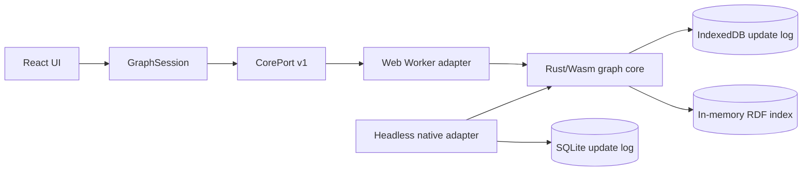

# Neoseq Architecture

## Purpose and Current Boundary

Neoseq is a local-first outliner. A graph contains pages, each page owns an
ordered tree of Markdown blocks, and journals provide the primary daily capture
surface. Typed properties add task and query behavior without introducing
feature-specific storage shapes.

The implemented product is a local Web client: React calls a Rust/Wasm core in
a Web Worker, IndexedDB stores the canonical Loro update history, and an
in-memory RDF index serves graph search and read-only SPARQL. A headless native
adapter verifies the same contracts with SQLite. Remote synchronization, Tauri
shells, and release infrastructure are planned in [`steps/`](steps/).

This document is the repository-wide architectural source of truth.
Component-level detail lives under [`architectures/`](architectures/), and
[`DESIGN.md`](DESIGN.md) is the frontend design source of truth.

## Drivers

- Local graphs work without a network connection.
- Rust owns domain rules, CRDT mutation, indexing, and query semantics.
- Platform code implements storage and binding concerns without domain policy.
- Canonical graph data remains portable Loro state; every index is disposable.
- User queries cannot access the filesystem, network, processes, or another graph.
- Presentation preferences and localization never mutate graph semantics.
- Nix provides reproducible development, build, and verification environments.
- Architecture remains no larger than current requirements; future delivery
  stages add their own compatibility and migration machinery when it is needed.

## Current System



The browser Worker owns the Wasm core and IndexedDB interaction. Main-thread
components receive immutable DTOs and semantic events; they do not receive Loro
containers or access persistence directly. The native adapter is a parity and
persistence test boundary, not a shipped application shell.

## Component Boundaries

- `domain` owns IDs, property definitions and values, commands, and invariants.
  It has no dependency on Loro, storage, transport, or UI frameworks.
- `graph-core` owns one graph runtime, Loro projection, transactions, local
  history, persistence coordination, remote-update import, and events.
- `query` owns Loro-to-RDF projection, indexing, constrained SPARQL planning,
  and budgeted read-only execution. It cannot mutate canonical state.
- `platform-web` exposes the product Wasm boundary.
- `platform-native` supplies the headless CorePort and SQLite adapter used for
  parity and recovery verification.
- `apps/client` owns interaction, navigation, browser-local preferences,
  localization, error presentation, and responsive UI.
- The future `sync-server` will own authentication, authorization, durable
  update relay, and server-side compaction; see
  [server architecture](architectures/server.md).

Detailed contracts:

- [Core and domain](architectures/core.md)
- [CRDT data and local persistence](architectures/data.md)
- [Property fields](architectures/properties.md)
- [Query and derived index](architectures/query.md)
- [Client application](architectures/clients.md)
- [Undo/redo navigation](architectures/history-navigation.md)
- [Property command picker](architectures/property-command-picker.md)
- [Internationalization](architectures/i18n.md)
- [Build and verification](architectures/build.md)
- [Future synchronization server](architectures/server.md)

## CorePort

The asynchronous CorePort v1 contract has seven operations:

```text
open_graph(locator) -> graph_handle + graph_summary
execute(graph_handle, command) -> command_result
read(graph_handle) -> graph_summary
read_page(graph_handle, page_id) -> page_view
query(graph_handle, sparql_request) -> select_result | ask_result
subscribe(graph_handle, cursor) -> graph_events
close_graph(graph_handle)
```

[`contracts/core-port.json`](contracts/core-port.json) generates the Rust and
TypeScript DTOs. [`fixtures/core-port/current.json`](fixtures/core-port/current.json)
is the shared adapter corpus. Large CRDT and archive payloads use transferable
binary buffers; ordinary values use generated DTOs. Adapter-only graph listing,
deletion, retry, and test controls are deliberately outside CorePort.

## Data and Consistency

- One graph is one Loro document and one independent storage and future sync unit.
- Pages and tags use stable IDs. Each page owns one page-local movable block tree.
- Page roots and blocks share collaborative content, a typed property bag, and
  explicit tag references.
- Page and tag names are unique in separate normalized graph-wide namespaces.
- Journal IDs derive deterministically from graph ID and local date.
- A property field is either an atomic single/set or a schema-owned CRDT
  document. Empty atomic fields are first-class; repeated values and document
  children have stable identities and independent merge granularity.
- [`contracts/property-registry.json`](contracts/property-registry.json) is the
  current v1 registry shared by core and client. Property keys have exactly two
  levels: application-defined `builtin.<name>` and graph-level user-defined
  `user.<name>`. Unknown built-ins remain readable but core-managed; unknown user
  properties remain readable and editable.
- Deleting a page is a soft delete and page references remain resolvable as
  tombstones. Deleting a tag soft-deletes its record and atomically detaches
  that tag from every page root and block; copied default-property values remain.
- Shared saved-view definitions are graph data. RDF triples, query results and
  plans, private presentation preferences, UI selection, and connection state
  are derived, user-scoped, or ephemeral and never canonical graph data.

One user intent becomes one domain command, one Loro transaction, one local undo
item, one durable update, and one semantic event. The runtime validates complete
structural changes before mutation. An update is reported saved only after the
repository append commits; a failed append holds the exact bytes for retry and
blocks additional mutation.

## Local Write Flow

1. The UI submits a domain command with an idempotency key.
2. `GraphRuntime` validates and applies one Loro transaction.
3. The repository appends the binary update durably.
4. The RDF index publishes a complete revision for the new Loro frontier.
5. Subscribers receive semantic graph and durability events.

The editor may render an operation optimistically only when it has a safe
inverse. Network availability is irrelevant to this current local flow.

## Security and Privacy

- Local graphs make no network requests.
- Query execution is confined to the current graph's derived index. Dataset
  selection, federation, SPARQL Update, and other I/O-capable forms are rejected.
- Raw internal errors stay behind typed stable error codes; the UI localizes
  safe messages.
- Future remote endpoints require TLS, authenticated membership, and limits on
  untrusted CRDT frames before acceptance.
- The planned first remote protocol is not end-to-end encrypted; E2EE requires
  a separate opaque-log and key-management design.

## Repository Shape

```text
crates/domain/             pure domain model and commands
crates/graph-core/         Loro runtime and application services
crates/query/              RDF projection and SPARQL execution
crates/platform-web/       Wasm bindings
crates/platform-native/    headless SQLite/CorePort adapter
apps/client/               React UI, Worker, IndexedDB, and browser tests
contracts/                 current source contracts
fixtures/                  current cross-adapter corpus
architectures/             component architecture documents
steps/                     future delivery plan
```

Dependencies point inward: platform and delivery code depend on the core and
domain, never the reverse.

## Evolution Rules

- Change a current contract and its generators, consumers, tests, and
  architecture together.
- Add compatibility fixtures only when the product genuinely supports more
  than one deployed contract or persisted schema.
- Add schema migration machinery when the first real migration is introduced;
  migration is not a placeholder in the current v1 document.
- New platforms implement existing ports rather than forking domain behavior.
- New metadata features use the property registry. New identity or relationship
  semantics require an explicit structural design.
- Derived-index format changes rebuild from Loro rather than migrate user data.
- Architecture-affecting code changes update this document and the relevant
  component document in the same change.
