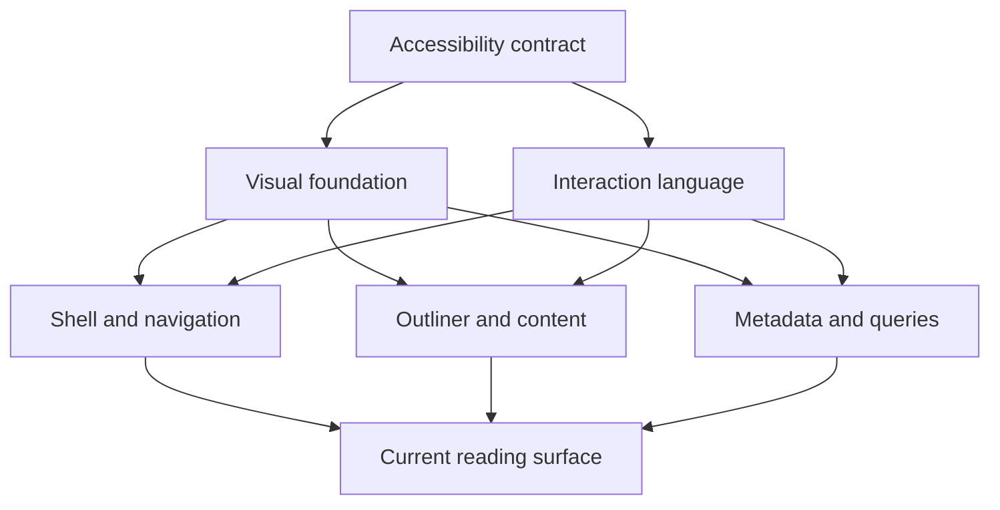

# Neoseq Design Architecture

## Purpose and Current Boundary

Neoseq is a local-first outliner. Its interface makes the graph's structure
legible without competing with the writing: pages and tags are places, blocks
form an outline, properties turn prose into records, and queries present derived
answers without becoming a second application.

This document is the repository-wide source of truth for design architecture.
It defines the durable experience model, the boundaries between design systems,
and the rules that resolve conflicts between them. Focused design architecture
lives under [`designs/`](designs/). Exact token values and component styling are
implementation records in [`apps/client/src/ui/app.css`](apps/client/src/ui/app.css),
not a second design specification.

The current boundary is the browser client across light and dark modes, desktop
and touch layouts, keyboard and pointer input, and supported locales. Native
shells should preserve these contracts unless their platform conventions provide
a materially more accessible interaction.

## Drivers

- The user's writing remains the visual and typographic subject.
- Structure carries meaning; decoration that encodes no state or relationship is
  excluded.
- A quiet interface remains discoverable through stable navigation, commands,
  focus behavior, and touch equivalents.
- Local-first operation is calm when healthy and explicit when work, sync, or
  recovery needs attention.
- The same semantic roles work in light and dark modes and across every supported
  accent choice.
- Direct manipulation never sacrifices a keyboard, command, or touch route.
- Stable geometry protects reading position, pointer intent, and the caret.
- Presentation preferences do not alter graph semantics.
- Accessibility and localization are system constraints, not component polish.

## Experience Model

The experience has five cooperating layers:

- The **visual foundation** supplies semantic color, type, depth, shape, and
  motion roles.
- The **shell** establishes place, global navigation, and the command entrance.
- The **outliner** owns the primary writing and structural reading experience.
- **Metadata and queries** enrich writing while remaining subordinate to it.
- The **interaction language** gives controls, overlays, manipulation, and
  feedback one shared behavior.

Accessibility constrains every layer. No component may locally trade away
contrast, keyboard reachability, focus clarity, or localized readability.

## Visual Language

- **Structure is the ornament.** The outline's quiet guides show indentation; a
  stronger branch shows the path to the caret. Structural marks appear only
  where they explain a real relationship.
- **Graphite and one accent.** Cool neutral surfaces and inks carry hierarchy.
  One accent identifies action, reference, focus, selection, and current place.
  Semantic status tones never become a second accent.
- **The writing is the typographic top.** Product chrome is smaller and quieter
  than authored content. Weight and color are reserved for hierarchy and state.
- **Depth is compositional.** Luminance establishes ground, a hairline closes a
  bounded object, and shadow expresses distance. A control is raised or inset;
  the hover surface is not a resting control style.
- **Both modes are one system.** Tokens are semantic and complete in light and
  dark modes. User-selectable color is limited to choices whose contrast can be
  guaranteed.
- **Motion explains change.** New layers may arrive; content already under the
  reader or pointer does not move decoratively.

See [Visual Foundation](designs/foundations.md).

## Spatial Architecture

The shell has one navigation region and one scrolling content region. Page
material owns the page edge; outline text owns an inset edge whose margin holds
bullets and branches. This distinction makes a page the root of its outline
rather than an oversized first block.

Permanent chrome is limited to navigation, place, primary surface controls, and
exceptional state. Contextual verbs are revealed near their object or summoned
through the command layer. The region below the last outline block remains a
writing target; additional bodies such as standing query answers begin only
after that target has retained its full reach.

Responsive layouts preserve these relationships rather than merely shrinking
them. The navigation rail becomes a drawer, settings panes stack, touch targets
grow, and hover-only affordances become visible or gain an explicit touch route.

See [Shell and Navigation](designs/shell-and-navigation.md) and
[Outliner](designs/outliner.md).

## Interaction Architecture

- Every capability has one canonical command and at least one pointer route.
  Touch and keyboard routes are first-class where the interaction applies.
- The primary verb of a surface is permanent. Secondary verbs may be revealed
  only when they remain discoverable through focus, touch, and the command layer.
- One state uses one primary visual signal. Color may reinforce a state that is
  already expressed by shape, position, text, or semantics.
- Focus, selection, current location, and keyboard roving are distinct states and
  use distinct indicators.
- A manipulation states where its result will land while preserving layout until
  commit. Reordering never makes the pointer chase moving content.
- An overlay belongs to the layer that summoned it, remains anchored to a valid
  geometry source, and yields Escape to the topmost open layer.
- Healthy steady state is silent. Work appears only after a flash threshold;
  failures are plain, actionable, and owned by exactly one surface.

See [Interaction](designs/interaction.md) and
[Accessibility](designs/accessibility.md).

## State Ownership

Design follows the product's data boundaries:

- Graph-shared state describes the graph or an object in it: tag identity and
  grouping, favourites and their order, property values, query definitions, and
  shared saved views.
- Browser-local durable state describes how one reader uses the product: theme,
  accent, rail geometry, open query disclosures, and folded answers.
- Session state describes the current act of use: caret, selection, open layers,
  drafts, loading, and scroll position.
- Derived state such as query results and counts is presented but never styled as
  canonical authored data.

Moving a preference across these boundaries requires both a product decision and
an architecture change; visual convenience alone is insufficient.

## Component Boundaries

- [Visual foundation](designs/foundations.md): semantic tokens, typography,
  depth, shape, iconography, motion, and mode invariants.
- [Shell and navigation](designs/shell-and-navigation.md): application frame,
  rail, top bar, global disclosure, command layer, settings, and first light.
- [Outliner](designs/outliner.md): page hierarchy, blocks, branch, Markdown,
  selection, and the append surface.
- [Metadata](designs/metadata.md): properties, tags, tasks, moments, tag
  organization, and their cross-surface identity.
- [Query](designs/query.md): answer surfaces, authoring, saved views, list and
  table presentation, and standing answers.
- [Interaction](designs/interaction.md): control states, choice, overlays,
  direct manipulation, and feedback.
- [Accessibility](designs/accessibility.md): perception, focus, input,
  semantics, localization, and verification.

## Implementation Boundary

`apps/client` implements this architecture with React, Tailwind CSS, and
shadcn/Radix primitives. Behavior primitives may supply focus management,
selection models, or positioning, but they do not supply Neoseq's appearance or
override its interaction contracts.

Semantic roles have one implementation owner. `app.css` owns the design tokens
and shared visual mechanisms; feature code consumes them and owns only the
composition specific to that feature. Reimplementing a global interaction or
declaring a competing token locally is an architectural violation.

## Evolution Rules

- Begin a new design with the existing semantic roles and interaction language;
  add a role only when the meaning cannot be expressed by the current system.
- Add a focused document when a design area acquires its own invariants,
  consumers, or evolution path. Keep repository-wide rules here.
- Record intent and boundaries in design documents; keep exact measurements and
  selector mechanics beside the implementation.
- A component-level change updates its focused design document. A change to the
  shared visual, spatial, interaction, or accessibility model updates this file
  as well.
- Verify both modes, responsive states, keyboard and pointer paths, supported
  locales, and reduced motion in proportion to the affected boundary.
- When design and implementation disagree, either restore the documented
  invariant or change the architecture explicitly; do not let drift become a
  third source of truth.
