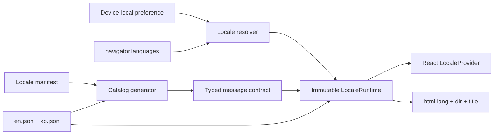

# Internationalization Architecture

## Scope

Internationalization is a presentation concern owned by each Web app. It translates
product chrome, commands, validation, notifications, and accessible names, and it
formats values for display. English (`en`) is the base locale and Korean (`ko`) is
the second supported locale in both the writing client and Admin Web app.

The UI locale does not translate user-authored page text, graph/page/tag/query-view
names, property values, SPARQL source, routes, or stable identifiers. It is
independent from the configured journal timezone and from any future content or
text-analysis language. Changing it never mutates graph data or crosses `CorePort`.

## Ownership and Runtime

`apps/client/src/i18n/` owns these writing-client concerns:

- the supported-locale manifest and ICU message catalogs;
- locale preference resolution and device-local persistence;
- typed message formatting and memoized `Intl` formatters;
- the registry and runtime for localized temporal input;
- the React provider and document `lang`, `dir`, and title updates.

`apps/admin/src/i18n/` owns a smaller runtime over the same boundary: typed
catalogs, browser-locale resolution, an admin-local preference, number formatting,
and document metadata. It does not depend on client settings, graph state, or
temporal input.



In both apps, `LocalePreference` is `system`, `en`, or `ko`. An explicit locale
wins. `system` checks `navigator.languages` in order and follows BCP 47 fallback
from the exact tag to language-script and base language (`ko-KR` matches `ko`),
then falls back to `en`. It follows the browser's `languagechange` event; an
explicit choice does not.

The client preference is stored in the versioned `neoseq.settings.v1` device settings
record alongside unrelated local preferences. The Admin app stores its independent
preference under `neoseq.admin.locale.v1`; it never persists the memory-only admin
session. Neither preference is graph metadata or synchronized. Each language control
applies a new preference immediately and the next launch restores it.

`LocaleRuntime` is recreated as one immutable value when the resolved locale
changes. The provider then updates all consumers and document metadata in the same
React commit. Features use this interface:

```text
message(id, values?)
formatNumber(value, options?)
formatBytes(value)
formatLocalDate(localDate, options?)
formatInstant(instant, timeZone, options?)
compare(left, right)
temporal.parseDate(text, context)
temporal.parseMoment(text, context)
locale + direction
```

Features do not import catalogs, inspect browser language settings, construct
user-visible `Intl` formatters, or call `toLocaleString` directly. Machine formats
may use invariant formatters where required by their contract.

## Locale Registry and Catalog Contract

Each app's `locales/manifest.json` declares supported tags, writing directions, and
localized label keys; the client manifest additionally selects temporal language
packs. The generator requires both apps to expose the same tags and directions.
Source catalogs are flat JSON files at `locales/<tag>.json`; dot-separated,
intent-based IDs retain feature ownership without runtime namespace loading.

English defines each app's complete message contract. `scripts/generate-i18n.mjs`
reads both manifests and every declared catalog, parses ICU MessageFormat, and
generates a typed module for each app containing:

- the locale definitions and `SupportedLocale` union;
- the valid `MessageKey` union;
- the required interpolation argument shape for each message.

Generation fails when supported app locales diverge, a locale has missing or extra
keys, ICU syntax is invalid, interpolation shapes differ, a manifest entry is
invalid, or a locale label is missing.
`devenv tasks run i18n:generate` compares the generated module and writes it only
when stale. Web tasks depend on `i18n:check`, and `outputs.web` and `outputs.admin`
check their respective generated contracts, so verification and production builds
reject stale output without modifying the checkout.

Catalogs use ICU messages for plurals and other grammatical variants. Components
translate complete phrases instead of concatenating fragments. Interpolation names
describe semantic values and are type checked. Messages render as text and cannot
inject HTML. User-authored content is always passed as data, never used as a message
or key.

All declared catalogs are eagerly included in the application bundle. The supported
set is intentionally small, so switching is atomic, needs no network request, and
works offline with the existing application-shell cache. If the supported set grows
enough to affect startup size, catalog chunking can replace the loader without
changing the feature-facing runtime.

## Presentation Boundaries

Command IDs, key bindings, routes, task/property enum values, and persisted values
remain stable. Command registries rebuild localized labels, keywords, and pointer
routes from the current runtime. A translated label never becomes an identifier.

Failure presentation maps stable `CorePortError` codes to localized reasons. A small
set of current validation errors is also mapped to dedicated keys; unknown or
unsafe core detail is replaced by a localized generic reason rather than shown as
English. Future errors that need interpolated context should add structured
parameters to the versioned CorePort contract.

The Admin app maps stable HTTP status classes to its own catalog and never presents
server-authored English error bodies as product copy.

All visible labels, programmatic names, descriptions, dialog controls, status text,
and live-region messages follow the same catalog. User-authored block text uses
`dir="auto"`; product direction comes from the locale manifest. Layout should use
logical CSS properties so a future RTL locale can use the same component tree.

## Dates, Numbers, and Ordering

`LocalDate` stays an ISO `YYYY-MM-DD` domain value. Display formatting constructs the
date at a fixed UTC calendar boundary, so the host timezone cannot move it to an
adjacent day. Instants are formatted in the configured journal timezone. Numbers,
storage quantities, and user-visible free-text ordering use the locale runtime.
Ordered domain choices use their locale-neutral registry rank; translation changes
their labels, never their position.

Localized date and time input is recognized by the temporal runtime and resolved
through locale-neutral calendar intents. ISO input works in every locale. The
language-pack boundary, ambiguity contract, and extension invariants are defined
in [Temporal Input Architecture](temporal-input.md).

Locale-aware collation is presentation only. Domain equality, page/tag uniqueness,
query semantics, persistence order, routes, DTOs, and exports remain locale-neutral.

## Verification and Extension

The verification boundary includes:

- generator drift, catalog parity, ICU syntax, and argument-shape checks;
- unit coverage for locale matching, fallback, ICU plural messages, date formatting,
  and every declared temporal language pack;
- a component test for immediate switching, document language, and persistence;
- focused Admin runtime and component coverage for negotiation, catalog formatting,
  immediate switching, document metadata, and persistence;
- desktop and mobile E2E coverage for switching and restoration after reload;
- the normal production TypeScript and Vite build.

To add a locale, add aligned entries and complete catalogs to both apps, add or select
a client temporal language pack, regenerate the typed contracts, and extend focused
locale and browser coverage. A locale release does not change the CRDT schema or
CorePort contract.
