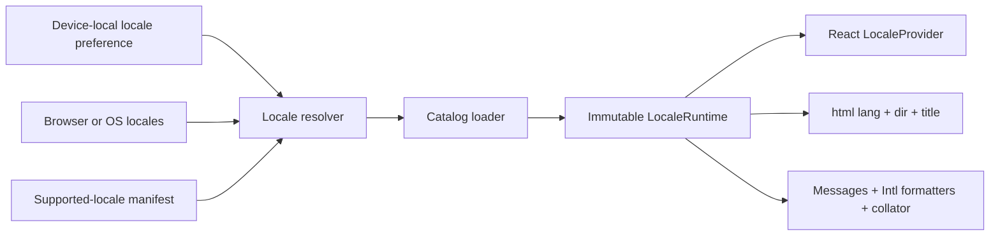

# Internationalization Architecture

## Scope and Boundaries

Internationalization is a presentation concern owned by `app-ui`. It translates
NeoSeq chrome, commands, validation, notifications, and accessible names, and it
formats values for display. It does not translate page text, graph/page/tag names,
property values, SPARQL source, or stable identifiers.

This document is the target contract for the i18n rollout. The current Step 5 client
still contains English literals and direct `Intl` calls; migration is complete only
when those call sites pass the verification rules below.

The following concepts remain independent:

- **UI locale:** a BCP 47 language tag used for product messages, collation, and
  display formatting;
- **writing/content language:** an attribute of user-authored text, when that is
  introduced, and never inferred from the UI locale;
- **journal timezone:** an IANA timezone used to resolve the current local date;
- **text-analysis language:** a future per-graph or per-query search concern, not a
  reason to rebuild the index when the UI locale changes.

Changing the UI locale therefore does not mutate a graph, cross `CorePort`, create a
CRDT update, or affect graph identity and name-uniqueness rules.

## Runtime Model



`LocalePreference` is either `system` or one tag from the build's supported-locale
manifest. `ResolvedLocale` contains the canonical tag, fallback chain, and writing
direction. The manifest is the only authority for supported tags and direction; a
caller cannot request an arbitrary asset path.

Resolution order is:

1. an explicit device-local preference;
2. the platform locale list (`navigator.languages` on Web, an OS adapter in Tauri);
3. the required base locale, `en`.

Matching canonicalizes tags and progressively removes subtags (`ko-KR` can match
`ko`) but never guesses between unrelated variants. `system` follows a platform
language change; an explicit preference does not. Locale preference belongs in one
versioned app-settings repository alongside theme and timezone. It is local to the
device/profile and is not stored in graph metadata or synchronized.

## Catalog Contract

Source catalogs live under `apps/client/src/i18n/locales/<locale>/`, split into
feature-aligned namespaces such as `common`, `commands`, `editor`, and `settings`.
The base English catalogs define the complete message contract. A generated module
provides the valid message-ID union and the interpolation shape for every message;
components cannot call the formatter with an unknown key or missing variable.

Message IDs describe intent (`settings.locale.system`), not English source text or a
DOM location. Catalog entries use ICU MessageFormat for plural, select, number, date,
and time behavior. Sentences are translated as units: components must not concatenate
translated fragments or encode English word order in JSX. Interpolation variables
have semantic names and pass typed values, not preformatted strings.

Catalog text is untrusted display data. It cannot inject HTML. Messages that require
emphasis or a link use a small, caller-declared set of structured component slots;
translators cannot introduce arbitrary elements, URLs, or event handlers.

The catalog compiler validates all locale files and generates:

- message IDs and parameter types;
- a locale manifest containing tag, native display name, direction, and namespaces;
- a catalog-schema fingerprint used to keep generated types and assets in one build.

Missing non-base translations may fall back through the resolved chain to English,
but missing base messages, invalid ICU syntax, extra parameters, and stale generated
artifacts fail CI. Development renders an obvious missing-message marker and reports
the key; production renders the base message and never exposes a raw key.

## Frontend Boundary

`apps/client/src/i18n/` owns locale resolution, catalog loading, the React provider,
document metadata, and memoized `Intl` instances. Components receive one narrow
interface:

```text
message(id, values?)
formatNumber(value, options?)
formatLocalDate(localDate, options?)
formatInstant(instant, timeZone, options?)
formatList(values, options?)
formatRelativeTime(value, unit)
compare(left, right)
locale + direction
```

Feature components do not import catalogs, inspect `navigator.language`, construct
`Intl` objects, or call `toLocaleString` directly. Framework/library-specific code is
confined to the catalog adapter and provider, so changing the message implementation
does not rewrite feature APIs.

The application bootstraps the resolved base and selected catalogs before mounting
React. A locale change loads and validates the complete target catalog, then replaces
one immutable `LocaleRuntime`; the previous runtime remains visible until that commit.
In the same commit the app updates `<html lang>` and `<html dir>`, updates localized
document metadata, and rebuilds localized derived registries such as command-palette
search labels. A load failure keeps the old locale and reports the failure in that
locale. This prevents partially translated frames and stale accessible names.

Command definitions retain stable command IDs and bindings but store message IDs for
labels, descriptions, disabled reasons, and pointer routes. Error presentation maps a
stable `CorePortError` code plus safe structured parameters to message IDs. The core's
diagnostic message is retained for logs and version-skew fallback, not treated as
normal user-facing English; an unknown code produces a localized generic failure and
retains its context in diagnostics. Adding an error parameter is a versioned
`CorePort` contract change; editing its translated wording is not.

## Formatting and Semantic Data

All display formatting flows through the current `LocaleRuntime`:

- user-visible numbers, byte quantities, timestamps, lists, and relative time use
  memoized `Intl` formatters;
- user-visible ordering uses a shared `Intl.Collator` with documented options;
- `LocalDate` remains an ISO `YYYY-MM-DD` domain value and is formatted using a fixed
  calendar boundary so the host timezone cannot move it to another day;
- an instant is formatted in the configured timezone, while journal “today” is still
  resolved from that timezone before the core receives `EnsureJournal(LocalDate)`;
- machine formats in routes, CorePort DTOs, persistence, exports, SPARQL, and property
  values never change with locale.

Natural-language journal date parsing is a locale adapter, not a translation-table
side effect. ISO input is accepted in every locale; relative words and month/weekday
names are registered and tested per locale. If a locale has no parser, the UI offers
ISO/native-date input rather than silently applying English grammar.

User-visible sorting does not define domain equality. The Rust core continues to own
page/tag normalization and uniqueness, and stable IDs break UI collation ties. A UI
locale switch neither renames entities nor changes query or search semantics.

## Routing, Offline, and Platforms

Routes contain stable graph/page IDs and invariant route segments; the locale is not
encoded in the hash route. This avoids multiple identities for the same local view and
lets one device preference apply across graphs.

The base catalog and all declared locale chunks are application-shell assets with
content hashes. The Service Worker precaches them in the same release as the code, so
locale selection and switching remain available offline and a catalog cannot drift
from its generated types. Catalogs contain no graph data and can be discarded with an
old application cache.

Web and future Tauri clients share catalogs and `LocaleRuntime`. Only discovery of
system locale and storage of the device preference use a platform adapter. The Rust
domain, Wasm/Worker protocol, native adapter, and sync server are locale-neutral.

## Layout and Accessibility

The provider sets `lang` and `dir` on the document before interactive content is
shown. All visible copy and all programmatic names, descriptions, live-region text,
validation messages, and image alternatives come from the same catalog contract.
Visible labels and accessible names use the same message unless additional context is
required for assistive technology.

Layout uses CSS logical properties (`margin-inline-start`, `inset-inline-end`, and
`text-align: start`) rather than physical left/right assumptions. Directional
navigation and indent/outdent icons mirror only when their meaning changes in RTL;
universal glyphs do not. User-authored text containers use `dir="auto"` so their
direction is independent of the chrome; a future explicit content language may
override it. Components tolerate translated labels expanding to at least twice the
English length, wrapping before truncating and never clipping a focus target or
status text.

## Verification and Delivery

CI enforces:

- catalog compilation, base-key completeness, parameter parity, and generated-file
  drift checks;
- unit tests for locale matching, fallback, plural/select cases, formatter caching,
  date-only timezone safety, collation tie-breaking, and atomic runtime replacement;
- component tests using an injected deterministic locale runtime rather than the host
  machine's locale;
- an expansion/accented pseudo-locale and an RTL pseudo-locale in visual and
  accessibility tests;
- focused end-to-end coverage for startup preference, runtime switching, offline
  switching, `<html lang/dir>`, localized command search, and live regions.

A feature is not localization-ready until its default messages, translator context,
typed variables, and pseudo-locale coverage land with the feature. A new locale is an
application release: add it to the manifest, provide its catalogs and locale-specific
date parser if supported, and pass the same component/accessibility suite. Catalog
changes do not version the CRDT schema or `CorePort`; a new machine-readable domain
value still requires its own stable contract independently of its translated label.
