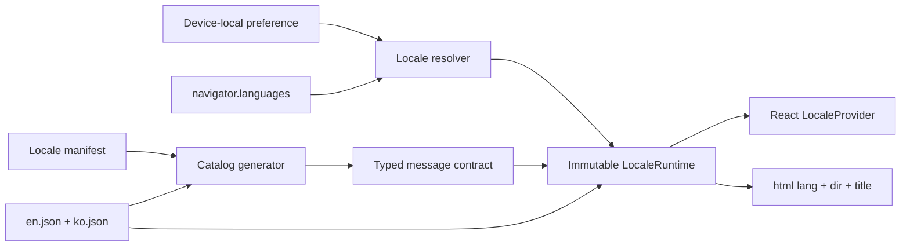

# Internationalization Architecture

## Scope

Internationalization is a presentation concern owned by `app-ui`. It translates
product chrome, commands, validation, notifications, and accessible names, and it
formats values for display. English (`en`) is the base locale and Korean (`ko`) is
the second supported locale.

The UI locale does not translate user-authored page text, graph/page/tag names,
property values, SPARQL source, routes, or stable identifiers. It is independent
from the configured journal timezone and from any future content or text-analysis
language. Changing it never mutates graph data or crosses `CorePort`.

## Ownership and Runtime

`apps/client/src/i18n/` owns:

- the supported-locale manifest and ICU message catalogs;
- locale preference resolution and device-local persistence;
- typed message formatting and memoized `Intl` formatters;
- the React provider and document `lang`, `dir`, and title updates.



`LocalePreference` is `system`, `en`, or `ko`. An explicit locale wins. `system`
checks `navigator.languages` in order, canonicalizes each BCP 47 tag to its base
language (`ko-KR` matches `ko`), and falls back to `en`. It follows the browser's
`languagechange` event; an explicit choice does not.

The preference is stored in the versioned `neoseq.settings.v1` device settings
record alongside unrelated local preferences. Updating it preserves unknown fields.
It is not graph metadata and is not synchronized. The settings view applies a new
preference immediately and the next launch restores it.

`LocaleRuntime` is recreated as one immutable value when the resolved locale
changes. The provider then updates all consumers and document metadata in the same
React commit. Features use this interface:

```text
message(id, values?)
formatNumber(value, options?)
formatBytes(value)
formatLocalDate(localDate, options?)
formatInstant(instant, timeZone, options?)
compare(left, right)
locale + direction
```

Features do not import catalogs, inspect browser language settings, construct
user-visible `Intl` formatters, or call `toLocaleString` directly. Machine formats
may use invariant formatters where required by their contract.

## Locale Registry and Catalog Contract

`locales/manifest.json` is the single registry of supported tags, writing
directions, and localized label keys. Adding a locale starts there. Source catalogs
are flat JSON files at `locales/<tag>.json`; dot-separated, intent-based IDs retain
feature ownership without requiring runtime namespace loading.

English defines the complete message contract. `scripts/generate-i18n.mjs` reads the
manifest and every declared catalog, parses ICU MessageFormat, and generates:

- the locale definitions and `SupportedLocale` union;
- the valid `MessageKey` union;
- the required interpolation argument shape for each message.

Generation fails when a locale has missing or extra keys, invalid ICU syntax, a
different interpolation shape, an invalid manifest entry, or a missing locale label.
`devenv tasks run i18n:generate` compares the generated module and writes it only
when stale. Web tasks depend on `i18n:check`, and `outputs.web` performs the same
check, so verification and production builds reject stale generated output without
modifying the checkout.

Catalogs use ICU messages for plurals and other grammatical variants. Components
translate complete phrases instead of concatenating fragments. Interpolation names
describe semantic values and are type checked. Messages render as text and cannot
inject HTML. User-authored content is always passed as data, never used as a message
or key.

All declared catalogs are eagerly included in the application bundle. The supported
set is intentionally small, so switching is atomic, needs no network request, and
works offline with the existing application-shell cache. If the supported set grows
enough to affect startup size, catalog chunking can replace the loader without
changing the feature-facing runtime.

## Presentation Boundaries

Command IDs, key bindings, routes, task/property enum values, and persisted values
remain stable. Command registries rebuild localized labels, keywords, and pointer
routes from the current runtime. A translated label never becomes an identifier.

Failure presentation maps stable `CorePortError` codes to localized reasons. A small
set of current validation errors is also mapped to dedicated keys; unknown or
unsafe core detail is replaced by a localized generic reason rather than shown as
English. Future
errors that need interpolated context should add structured parameters to the
versioned CorePort contract.

All visible labels, programmatic names, descriptions, dialog controls, status text,
and live-region messages follow the same catalog. User-authored block text uses
`dir="auto"`; product direction comes from the locale manifest. Layout should use
logical CSS properties so a future RTL locale can use the same component tree.

## Dates, Numbers, and Ordering

`LocalDate` stays an ISO `YYYY-MM-DD` domain value. Display formatting constructs the
date at a fixed UTC calendar boundary, so the host timezone cannot move it to an
adjacent day. Instants are formatted in the configured journal timezone. Numbers,
storage quantities, and user-visible ordering use the locale runtime.

Journal date commands use locale-specific parsing. ISO input works in every locale.
English accepts its relative, weekday, and month forms; Korean accepts forms such as
`오늘`, `3일 전`, `다음 금요일`, and `8월 5일`. Parsing returns the same invariant
`LocalDate` consumed by the core.

Locale-aware collation is presentation only. Domain equality, page/tag uniqueness,
query semantics, persistence order, routes, DTOs, and exports remain locale-neutral.

## Verification and Extension

The verification boundary includes:

- generator drift, catalog parity, ICU syntax, and argument-shape checks;
- unit coverage for locale matching, fallback, ICU plural messages, date formatting,
  and English/Korean natural-language dates;
- a component test for immediate switching, document language, and persistence;
- desktop and mobile E2E coverage for switching and restoration after reload;
- the normal production TypeScript and Vite build.

To add a locale, add one manifest entry and one complete catalog, add any supported
date grammar, regenerate the typed contract, and extend focused locale and browser
coverage. A locale release does not change the CRDT schema or CorePort contract.
