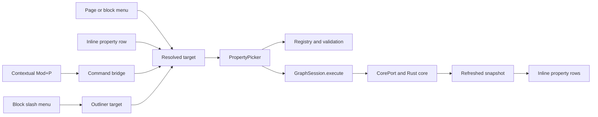

# Property Command Picker Architecture

## Status and Scope

This document describes the shipped Web-client architecture for the
[Property Command Picker specification](../specs/property-command-picker.md).
It replaces the expanded page and block property forms with inline snapshot
projections and one contextual picker.

The change is client-side only. It does not change the graph schema, property
registry, CorePort contract, CRDT encoding, or domain command set.

## Architectural Decision

Every property entry route resolves one stable page or block target and opens
the same `PropertyPicker`. The picker owns only transient navigation and input
state. Canonical properties remain in immutable session snapshots, and every
mutation travels through `GraphSession.execute`.



## Ownership Boundaries

### Outline and Slash Commands

`features/outline/Outliner.tsx` owns slash detection because it owns block
drafts, carets, IME composition, and pending-block reconciliation.

Detection is a pure scan of the current whitespace-delimited token at a
collapsed caret. A token beginning with `/` opens the slash menu when its query
reaches at least one declared item. A token beginning with `#` opens the tag
menu the same way: existing tags ranked by the palette's fuzzy scorer, plus one
create row for a non-empty query with no exact canonical match. Accepting
removes the token and issues `ensure_tag` (create row only) followed by
`add_tag`; a tag the block already carries writes nothing. Pending blocks defer
the choice until the real `BlockId` lands, exactly like a slash choice.
Detection never changes Markdown.

Slash items are declared in `features/outline/slash-commands.tsx`: task
statuses and priorities as **direct** items carrying one `PropertyValue`, and
`Scheduled` / `Deadline` / `Add property` as **picker** items carrying an
optional initial key. Labels are localized; matching runs the palette's fuzzy
scorer over labels plus English and Korean aliases. An empty query renders the
declared groups in order; a non-empty query renders one ranked list.

The menu keeps focus in the textarea. `↑`/`↓` move the active row, `Enter` and
`Tab` accept it, `Escape` dismisses without changing the draft, and detection
stands down during IME composition. Accepting always removes the recognized
token first; a direct item then issues a single `set_property` through the
session, while a picker item opens `PropertyPicker`, already on its key when it
has one. A persisted block flushes through the normal Markdown draft path
first.

Pending blocks do not cross into the picker or a command under temporary IDs.
The outliner remembers the chosen action, waits for `insert_block` to return
the real `BlockId`, transfers raced text through the existing pending-row path,
and only then replays it — a direct write executes, a picker intent opens.
Insert failure uses the existing pending-insert report and never opens a picker
for a missing target.

### Command Bridge and `Mod+P`

`features/commands/shortcuts.ts` owns the default `Mod+P` binding. The shell
removes it from the general browser-reserved set but claims it only if
`CommandBridge.requestProperties()` reports an available target. Without a
registered page or block handler the event is not prevented, so the browser
retains Print.

`requestProperties(key?)` also accepts an initial property key. The palette's
task rows (`set-status`, `set-priority`, `set-scheduled`, `set-deadline`) ride
this to open the same picker directly on a `builtin.task-*` key for the focused
block or the mounted page; their pointer routes are the slash menu and the task
chips.

The outliner registers the focused persisted block. `PageProperties` registers
the mounted page. The bridge gives a block handler precedence and otherwise
uses the page handler. Pending blocks do not register.

Pointer routes resolve explicitly:

- a property row supplies its owner, key, and row element;
- the block menu supplies its block and textarea;
- the page menu opens a fresh page-level property search; and
- the separate block `Tags` menu opens `TagPicker`, never `PropertyPicker`.

Once opened, a picker request contains stable IDs and cannot be retargeted by a
later focus change.

### Property Picker

`features/properties/PropertyPicker.tsx` owns three transient stages:

```text
property search -> optional custom type -> value edit
```

An existing row starts at value edit. A known registry key carries its declared
type and cardinality. A valid unknown `user.*` key requires an explicit value
type and is single-valued under current client rules. Unknown `builtin.*` keys
remain visible for forward compatibility but are read-only. Moving between
stages writes nothing.

The picker resolves three target kinds: a page, a block, or a tag. A tag
target edits the tag's *defaults* — candidates are bounded by the
`tag_default` placement, values validate as single-valued, and writes travel
as `set_tag_default` / `remove_tag_default`. The routed tags view is the
surface that opens this target.

Property candidates are bounded to:

1. generic-visible keys already present on the target;
2. registry definitions that are user-writable on the resolved target; and
3. one validated custom-key creation result for the current query.

Existing keys sort first. The picker does not scan the graph document or any
adapter-owned state.

Value controls are selected from the property type and definition:

- allowed strings and checkboxes use explicit choice rows; the task status and
  priority keys lead their rows with the shared shape glyphs and localized
  labels, and a stored value outside the offered set stays listed;
- strings and numbers use text inputs with explicit commit;
- dates use one natural-language field (the palette's `parseDateQuery`) whose
  resolved day is a pressable preview row, quick rows for today / tomorrow /
  next week, and the native date input as the precision fallback — every route
  commits directly;
- pages reuse `PageAutocomplete`; and
- repeated values show individually removable members plus whole-key clear.

Candidate and type rows lead with a glyph — the feature's own mark for a
builtin key, the value-type glyph otherwise. Keys present through
`property-display.tsx`: a builtin key shows its localized product name, a user
key shows its bare name in the mono voice, and a bare query creates
`user.<name>` so the storage prefix is never typed or read. Every surface that
prints a key (picker, block chips, page strip) goes through the same module.

The picker is portaled to `document.body` and positioned in viewport space from
the invoking element. This avoids clipping by the scroll container and the
virtualizer's transformed rows. Outside press, `Escape`, or a successful command
closes it. Closing restores focus to the invoking element when it still exists.

### Property and Tag Presentation

`BlockChips` is the stateless block projection: one wrapping strip of chips
under the line carrying the task facts (priority, scheduled, deadline —
deriving the overdue state from the journal's own today) followed by every
generic property in the same chip language. Pages retain their compact
four-item strip. Both use the client presentation registry to show generic and
feature-enhanced properties, format page references against the current
snapshot, and invoke the picker for direct editing via `openProperties` with
the chip's key and anchor. Read-only metadata and hidden lifecycle fields never
enter the generic route. Values truncate without changing stored data. An
empty bag renders no strip.

Task status stays a **positioned renderer** at the head of the line
(`entities/tasks.ts` names the task-key set excluded from the generic chips):
`TaskStatusControl` renders the status glyph and owns its `menuitemradio` menu,
including the explicit remove row. On pages the four task keys stay in the
generic strip.

The legacy `PropertyBagEditor` and block inspector are removed. Tag membership
lives in `TagPicker` — which reuses `TagChips` and `PageAutocomplete` while
continuing to issue `add_tag` and `remove_tag` commands — and inline in the
outline's `#` tag menu. `TagChips` renders as a right-aligned cluster on the
block's own line. `features/tags/TagsView.tsx` is the routed tag index: it
lists every live tag and opens the picker on a tag target for its defaults.

The query projection remains a view over well-known properties with the
generic chips as its edit route; the task facts' edit routes are their own
chips, which open the same picker.

## Command Mapping

The picker maps user intent onto the existing domain commands:

| User intent                     | Core command               |
| ------------------------------- | -------------------------- |
| Set or replace a single value   | `set_property`             |
| Clear a single key              | `remove_property`          |
| Add a repeated member           | `add_repeated_property`    |
| Remove a repeated member        | `remove_repeated_property` |
| Set a tag default (tag target)  | `set_tag_default`          |
| Clear a tag default (tag target)| `remove_tag_default`       |

The existing `builtin.query-source` orchestration remains: a successful source write
also materializes the default `builtin.query-language` when absent. This still uses a
second ordinary core command; no batch command or schema change is introduced.

## Snapshot and Lifecycle Rules

- Targets and bags are derived from `SessionState.snapshot` on every render.
- The picker never mutates a snapshot or renders an optimistic property row.
- Session reconciliation refreshes the owning page before the new row appears.
- If the target leaves the current page, the outliner can no longer resolve it
  and therefore unmounts the picker.
- Page and block pickers are owned by their routed view and disappear with it.
- Read-only state keeps rows readable and disables mutation actions.

## Validation and Failure Reporting

The current domain contract supplies only composed value shapes and target
placements to `entities/properties.ts`; all type, cardinality, string-choice,
write, and default checks are derived from them. Generic/hidden presentation is
also derived from placements, while sparse client-owned feature and metadata
renderer sets provide the exceptional rendering paths.
Keys outside `builtin.*` and `user.*`, malformed two-level keys, and core-managed
built-ins fail in the active stage; target, date, number, length,
restricted-string, and cardinality checks run before dispatch. The core repeats
all semantic checks and remains authoritative.

A rejected session command keeps the active picker state and reports once
through `features/notify/`. No failed mutation creates a row. Local durability,
retry, and save-state behavior remain owned by `GraphSession` and its adapter.

## Accessibility and Localization

- Property search is a combobox with an active-descendant listbox.
- Type and fixed-value choices expose listbox/option semantics.
- The picker has a localized dialog name, inputs have key-specific labels, and
  destructive clear/remove actions have explicit accessible names.
- Slash and shortcut matching stand down during IME composition.
- User property keys and values are never translated. Here `user.*` means a
  user-defined graph property, not private metadata owned by one account. All
  chrome comes from the typed English and Korean catalogs.
- Focus returns to the invoking row, textarea, or page subject after close.

## Dependency Direction

```text
outline slash state -------\
command bridge ------------+--> PropertyPicker --> GraphSession --> CorePort
page/block pointer routes -/          |                  |
                                       v                  v
                              entities/properties   refreshed snapshot
                                       |
                                       v
                                    UI / i18n
```

Feature code depends inward on `entities`, `core-port`, `i18n`, and `ui`. The
picker does not import Worker, Wasm, IndexedDB, Tauri, Loro, or query-index
implementations.

## Verification Boundary

- Component tests cover all five value types, custom keys, validation, direct
  row editing, slash-token removal, slash grouping and one-keystroke status
  writes, the inline status control and task chips, the natural-language date
  editor, known enums, and tag separation.
- Outline tests continue to cover pending-row reconciliation, structure, undo,
  selection, and virtualization-sensitive focus behavior.
- Shortcut tests cover the new default, conflicts, formatting, and browser-key
  reservation rules.
- Browser tests cover property persistence, slash invocation, tag membership,
  query/task projections, accessibility, and reload.
- Native/Wasm contract suites cover property round-trip, persistence, rejection,
  and undo through the current CorePort corpus.
