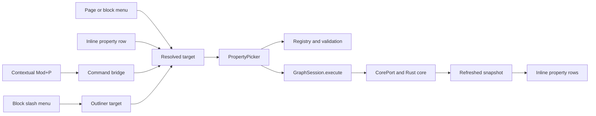

# Property Command Picker Architecture

## Status and Scope

This document describes the shipped Web-client architecture for property
editing: inline snapshot projections plus one contextual picker.

The picker uses the shared field and owner contracts described in
[Property fields](properties.md). Its presentation remains client-owned while
all persistence and validation stay in the domain and graph core.

## Architectural Decision

Every property-field route resolves one stable owner and opens
the same `PropertyPicker`. The picker owns only transient navigation and input
state. Canonical properties remain in immutable session snapshots, and every
mutation travels through `GraphSession.execute`.



## Ownership Boundaries

### Outline and Slash Commands

`features/blocks/editor` owns slash and hash detection, ranking, token removal,
and menu presentation. Outline and query adapters apply the chosen action to
their own draft sessions; the outline additionally owns pending-block
reconciliation.

Detection is a pure scan of the current whitespace-delimited token at a
collapsed caret. A token beginning with `/` opens the slash menu when its query
reaches at least one declared item. A token beginning with `#` opens the tag
menu the same way: *existing* tags ranked by the palette's fuzzy scorer — tag
creation belongs to the tags view, so a query nothing matches closes the menu.
Accepting removes the token and issues `add_tag`; a tag the block already
carries writes nothing. Pending blocks defer the choice until the real
`BlockId` lands, exactly like a slash choice. Detection never changes Markdown.

Slash items are declared in `features/blocks/editor/slash-commands.tsx`: task
statuses and priorities as **direct** items carrying one `PropertyValue`,
`Scheduled` / `Deadline` / `Add property` as **picker** items carrying an
optional initial key, and `Query blocks` / `Query pages` / `Query tags` as
**query** items carrying the subject a new plan starts on. `/` is the only route
to a query: `builtin.query` is deliberately absent from the picker's candidates
(`entities/properties.ts` marks it `feature_only`), so a query is never
half-created through the generic property route, and it has no tag-default
placement either. The query block owns every later edit, including its removal.

Labels are localized; matching runs the palette's fuzzy scorer over labels plus
English and Korean aliases. An empty query renders the declared groups in order;
a non-empty query renders one ranked list.

The menu keeps focus in the textarea. `↑`/`↓` move the active row, `Enter` and
`Tab` accept it, `Escape` dismisses without changing the draft, and detection
stands down during IME composition. Accepting always removes the recognized
token first; a direct item then issues a single `set_property` through the
session, a query item issues a single `set_query_plan`, and a picker item opens
`PropertyPicker`, already on its key when it has one. A persisted block flushes
through the normal Markdown draft path first.

Pending blocks do not cross into the picker or a command under temporary IDs.
The outliner remembers the chosen action, waits for `insert_block` to return
the real `BlockId`, transfers raced text through the existing pending-row path,
and only then replays it — a direct write or a query creation executes, a picker
intent opens.
Insert failure uses the existing pending-insert report and never opens a picker
for a missing target.

### Command Bridge and `Mod+P`

`features/commands/shortcuts.ts` owns the default `Mod+P` binding. The shell
removes it from the general browser-reserved set but claims it only if
`CommandBridge.requestProperties()` reports an available target. Without a
registered page or block handler the event is not prevented, so the browser
retains Print.

`requestProperties(key?)` also accepts an initial property key. The palette's
task rows (`set-status`, `set-priority`, `set-scheduled`, `set-deadline`) ride
this to open the same picker directly on a `builtin.task-*` key for the focused
block or the mounted page; their pointer routes are the slash menu and the task
chips.

Every active block editor registers a contextual target. Registrations are
focus-ordered so a query result nested inside an outline row wins while it is
active and removing it restores the containing block. `PageProperties`
registers the mounted page as the fallback. Pending outline blocks register a
deferred target whose command is replayed after their real ID arrives.

Pointer routes resolve explicitly:

- a property row supplies its owner, key, and row element;
- the block menu supplies its block and textarea;
- the page menu opens a fresh page-level property search; and
- the separate block `Tags` menu opens `TagPicker`, never `PropertyPicker`.

Once opened, a picker request contains stable IDs and cannot be retargeted by a
later focus change.

### Property Picker

`features/properties/PropertyPicker.tsx` owns three transient stages:

```text
property search -> optional custom type -> value edit
```

An existing row starts at value edit. A known registry key carries its declared
type and cardinality. A valid unknown `user.*` key requires an explicit value
type and is single-valued under current client rules. Unknown `builtin.*` keys
remain visible for forward compatibility but are read-only. Moving between
stages writes nothing.

The picker resolves three target kinds: a page, a block, or a tag default. A
tag-default target uses the same `PropertyOwner` and command family as other
targets; candidates remain bounded by the `tag_default` placement. The routed
tags view is the surface that opens this target.

Property candidates are bounded to:

1. generic-visible keys already present on the target;
2. registry definitions that are user-writable on the resolved target; and
3. one validated custom-key creation result for the current query.

A key whose feature owns its whole surface — currently only `builtin.query` — is
outside all three, on either an entity or a tag default.

Existing keys sort first. The picker does not scan the graph document or any
adapter-owned state.

Value controls are selected from the property type and definition:

- allowed strings and checkboxes use explicit choice rows; the task status and
  priority keys lead their rows with the shared shape glyphs, tinted by the state
  palette, and localized labels, and a stored value outside the offered set stays
  listed. Offer order is a presentation decision made in `entities/tasks.ts`, not
  a registry one: status keeps the registry's ascending progression and priority
  is offered strongest-first;
- strings and numbers use text inputs with explicit commit;
- generic dates use one natural-language field, quick rows for today / tomorrow /
  next week, and the native date input as the precision fallback. A **task**
  moment instead opens one product-owned editor: natural-language date/time
  search, the same quick choices, an accessible month calendar, an optional
  segmented 24-hour clock, and the task's shared recurrence all shape one local
  draft. Done applies its date, companion `-time` fact, and any changed
  `builtin.task-repeat` through one property patch; Cancel applies none. An
  uninterpreted stored recurrence is preserved until the recurrence control is
  deliberately changed;
- `builtin.task-repeat` uses a count field, a unit menu, and a words preview of
  the interval they make;
- pages reuse `PageAutocomplete`; and
- repeated values show individually removable members plus whole-key clear.

Candidate and type rows lead with a glyph — the feature's own mark for a
builtin key, the value-type glyph otherwise. A key's mark is untinted, because it
stands for the property rather than for a value the property holds. Keys present through
`property-display.tsx`: a builtin key shows its localized product name, a user
key shows its bare name in the mono voice, and a bare query creates
`user.<name>` so the storage prefix is never typed or read. Every surface that
prints a key (picker, block chips, page strip) goes through the same module.

Outside-press dismissal exempts the surfaces the picker itself opens — the entity
autocomplete and the one dropdown both portal to the body, so a press on one of
their rows is outside the panel in the DOM and inside the editor to the user. The
z-index scale carries the matching order: `--z-menu` sits above `--z-popover`,
because a menu and a popover only ever coexist when the popover opened the menu.

The picker is portaled to `document.body` and positioned in viewport space from
the invoking element. This avoids clipping by the scroll container and the
virtualizer's transformed rows. Placement itself is not the picker's own: every
anchored panel in the client — this picker, the tag picker, the slash and tag
menus, `PageAutocomplete` — goes through `ui/anchored`, which prefers the space
below the anchor, pins the panel by its `bottom` and lets it grow upward when the
space below cannot hold it, and caps its height at the room actually available on
the side it chose. Outside press, `Escape`, or a successful command closes it.
Closing restores focus to the invoking element when it still exists.

### Property and Tag Presentation

`BlockChips` is the stateless block projection: one wrapping strip of chips
under the line carrying the task facts (priority, scheduled, deadline —
deriving the overdue state from the journal's own today) followed by every
generic property in the same chip language. Pages retain their compact
four-item strip. Both use the client presentation registry to show generic and
feature-enhanced properties, format page references against the current
snapshot, and invoke the picker for direct editing via `openProperties` with
the chip's key and anchor. Read-only metadata and hidden lifecycle fields never
enter the generic route. Values truncate without changing stored data. An
empty bag renders no strip.

Task status and priority stay **positioned renderers** at the head of the line
(`entities/tasks.ts` names the task-key set excluded from the generic chips):
`TaskStatusControl` and `TaskPriorityControl` render their glyphs and each owns its
`menuitemradio` menu, including an explicit remove row. `TaskStatusControl` also
owns the recurrence behaviour: when the block carries an interval and a moment,
`Done` becomes `Complete this one` and issues the ordinary property commands that
advance the dates and keep the status at `todo`. On pages the task keys stay in the
generic strip.

The moment chips read their companion time key and their due tier, and carry the
tier's tone through the shared task presentation path that `ui/app.css` resolves.
A day threshold
counts calendar dates with today as day one, so an N-day tier ends N-1 dates
after today. Today is a fixed tier between overdue and soon; a time earlier today
remains overdue. Both the thresholds and tones are browser-local presentation
preferences read through `features/settings/preferences.ts`; neither reaches a
command or the graph.
The default tones progress from danger through attention and caution to
information and neutral; the success tone is not used as a time distance.
Stored tones are backward-compatible named presets or bounded OKLCH hue/chroma
pairs. The settings surface exposes one color well per tier and previews custom
choices in both modes; CSS owns mode-specific lightness, and all task chips and
query cells consume the same resolved presentation.

Tag membership
lives in `TagPicker` — which reuses `TagChips` and `PageAutocomplete` while
continuing to issue `add_tag` and `remove_tag` commands — and inline in the
outline's `#` tag menu; both attach existing tags only. `TagChips` renders as
a right-aligned cluster on the block's own line, each chip a single remove
button. `features/tags/TagsView.tsx` owns the tag lifecycle: a card per live
tag, inline creation (`ensure_tag`), confirmed graph-wide deletion
(`delete_tag`, which detaches every page and block membership), and the picker
on a tag target for defaults.

The query projection remains a view over the well-known `builtin.query`
document. The outline's `/` menu creates it through `set_query_plan`, and the
mounted query block owns every later edit: the builder writes plan and compiled
source together, the SPARQL escape hatch splices source, saved views and their
column layout go through document-specific commands, and the block's own menu
removes the property. Task facts retain their own chips, which open the same
picker.

## Command Mapping

The picker maps user intent onto the existing domain commands:

| User intent                     | Core command               |
| ------------------------------- | -------------------------- |
| Create an empty field           | `ensure_property`          |
| Set or replace a single value   | `set_property`             |
| Clear values but keep the field | `clear_property_values`    |
| Remove the complete field       | `remove_property`          |
| Add a repeated member           | `add_repeated_property`    |
| Remove a repeated member        | `remove_repeated_property` |

`builtin.query` is the one document exception to the atomic mapping. Setting its
plan or its source creates the complete valid document with stable table/list
views in one command. Generic commands cannot replace or clear its document
value; removing the complete field still uses `remove_property`, which is what
the query block's own `Remove query` issues.

## Snapshot and Lifecycle Rules

- Targets and bags are derived from `SessionState.snapshot` on every render.
- The picker never mutates a snapshot or renders an optimistic property row.
- Session reconciliation refreshes the owning page or tag outline before the new row appears.
- If the target leaves the current outline, the outliner can no longer resolve it
  and therefore unmounts the picker.
- Entity and block pickers are owned by their routed view and disappear with it.
- Read-only state keeps rows readable and disables mutation actions.

## Validation and Failure Reporting

The current domain contract supplies only composed value shapes and target
placements to `entities/properties.ts`; all type, cardinality, string-choice,
write, and default checks are derived from them. Generic/hidden presentation is
also derived from placements, while sparse client-owned feature and metadata
renderer sets provide the exceptional rendering paths.
Keys outside `builtin.*` and `user.*`, malformed two-level keys, and core-managed
built-ins fail in the active stage; target, date, number, length,
restricted-string, and cardinality checks run before dispatch. The core repeats
all semantic checks and remains authoritative.

A rejected session command keeps the active picker state and reports once
through `features/notify/`. No failed mutation creates a row. Local durability,
retry, and save-state behavior remain owned by `GraphSession` and its adapter.

## Accessibility and Localization

- Property search is a combobox with an active-descendant listbox.
- Type and fixed-value choices expose listbox/option semantics.
- The picker has a localized dialog name, inputs have key-specific labels, and
  destructive clear/remove actions have explicit accessible names.
- The task calendar and segmented clock expose the React Aria keyboard model;
  search and quick choices remain ordinary named controls.
- Slash and shortcut matching stand down during IME composition.
- User property keys and values are never translated. Here `user.*` means a
  user-defined graph property, not private metadata owned by one account. All
  chrome comes from the typed English and Korean catalogs.
- Focus returns to the invoking row, textarea, or page subject after close.

## Dependency Direction

```text
outline slash state -------\
command bridge ------------+--> PropertyPicker --> GraphSession --> CorePort
page/block pointer routes -/          |                  |
                                       v                  v
                              entities/properties   refreshed snapshot
                                       |
                                       v
                                    UI / i18n
```

Feature code depends inward on `entities`, `core-port`, `i18n`, and `ui`. The
picker does not import Worker, Wasm, IndexedDB, Tauri, Loro, or query-index
implementations.

## Verification Boundary

- Component tests cover all five atomic value types, custom keys, validation,
  direct row editing, slash-token removal, slash grouping and one-keystroke
  status writes, the inline status control and task chips, the natural-language
  date editor, the atomic task-moment draft and undo boundary, known enums, and
  tag separation. The query document has its own
  suite: `/` creating a plan, conditions and nested groups reaching the compiled
  source, column and view layout persisting, the SPARQL escape hatch, removal,
  and the picker's refusal to offer the key.
- Outline tests continue to cover pending-row reconciliation, structure, undo,
  selection, and virtualization-sensitive focus behavior.
- Shortcut tests cover the new default, conflicts, formatting, and browser-key
  reservation rules.
- Browser tests cover property persistence, slash invocation, tag membership,
  query/task projections, accessibility, and reload.
- Native/Wasm contract suites cover property round-trip, persistence, rejection,
  and undo through the current CorePort corpus.
