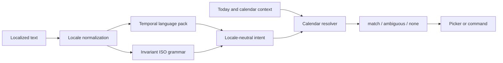

# Temporal Input Architecture

## Purpose

Temporal input turns localized phrases into the invariant `LocalDate` and
24-hour time values used by the application. It is presentation input: changing
language recognition never changes persisted data, calendar identity, or the
CorePort contract.

## Boundaries

Language packs own words, word order, morphology, and locale-specific clock
forms. They recognize text into a small semantic intent vocabulary: absolute or
calendar dates, relative calendar units, weekdays, and optional clock time. They
do not perform date arithmetic or read global time.

The resolver owns validation and calendar arithmetic. Its explicit context
anchors relative expressions to the same local day used by journals. A month is
a calendar month, not a fixed number of days. Only resolved ISO dates and
`HH:MM` times cross into feature or persistence code.

## Registry and Fallback

Each locale manifest entry names a temporal language pack. Multiple regional or
script locales may deliberately share one pack. Locale selection follows BCP 47
fallback from exact tag to language-script and then base language; grammar does
not silently fall back to English after a locale has been selected.

ISO dates, ISO date-time pairs, and 24-hour clock values form the invariant
grammar available in every locale. Everything else belongs to a declared pack.
The generated locale check rejects a manifest entry whose pack is missing.

Packs expose executable examples and a support level. A recognition returns one
match, explicit alternatives, or no match. Features may ask the user to resolve
alternatives; they must never guess when a phrase is ambiguous.

## Extension Invariants

Adding a language consists of declaring a locale and its pack, translating the
catalog, and adding focused grammar examples. A pack may use tables for simple
languages or code for morphology, but it must consume the whole normalized
input and emit only shared intents.

Verification covers every declared pack's examples, invariant input in every
locale, impossible dates, calendar boundary arithmetic, localized clock forms,
and locale fallback. Parser implementation can later be code-split or replaced
behind the same runtime contract without changing features or stored values.
