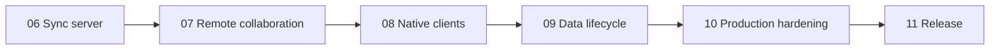

# Neoseq 구현 계획

## 목적

이 디렉터리는 [전체 아키텍처](../ARCHITECTURE.md)를 검증 가능한 구현
딜리버러블로 분해한다. 각 단계는 단순히 코드가 추가되었다는 사실이 아니라,
사용자 또는 CI가 독립적으로 실행하고 관찰할 수 있는 결과를 만든 뒤 종료한다.

단계 문서는 구현 순서와 종료 조건을 정의한다. 실제 구현 중 아키텍처 결정이
달라지면 코드를 먼저 맞추지 않고 `ARCHITECTURE.md`, 관련 `architectures/` 문서,
이 계획을 같은 변경에서 갱신한다.

## 단계 운영 원칙

1. 각 단계는 이전 단계의 공개 계약만 사용한다.
2. 단계 종료 시 `nix flake check`에는 그 시점까지 완성된 모든 회귀 검사가
   포함되어야 한다.
3. 수동 데모는 자동 검사가 놓치는 UX와 플랫폼 동작을 확인하는 보조 수단이다.
   수동 데모만으로 단계가 완료되지는 않는다.
4. 다음 단계용 placeholder, mock, feature flag는 현재 단계의 완료 조건을 흐리지
   않는 범위에서만 허용한다.
5. canonical data를 쓰는 경로에는 최소 한 개의 재시작/복구 검사와 native/Wasm
   일치 검사가 있어야 한다.
6. 비 Markdown 기능은 기존 uniform property 모델로 구현한다. 새로운 전용 저장
   필드나 CRDT container를 추가하면 아키텍처 변경으로 취급한다.
7. 한 단계가 끝날 때 미완료 항목은 숨기지 않고 다음 단계 문서의 범위 또는
   명시적인 후속 이슈로 이동한다.

## 단계 요약

Step 1–5의 결과는 현재 코드와 아키텍처 문서에 반영되어 있으며, 완료 당시의
계획과 검증 기록은 버전 관리 이력에서 확인한다. 저장소에는 아직 의사결정과
구현에 영향을 주는 단계만 유지한다.

- [06. Sync server](06-sync-server.md): PostgreSQL에 update를 durable-ack하는
  synchronization server를 제공한다. Server alpha 지점이다.
- [07. Remote collaboration](07-remote-collaboration.md): 두 Web client가
  offline edit 후 재접속·수렴한다. **Remote beta** 지점이다.
- [08. Native client](08-native-clients.md): 동일 graph를 macOS와 Android 설치
  app에서 사용한다. **Cross-platform beta** 지점이다.
- [09. Data lifecycle](09-data-lifecycle.md): migration, checkpoint, archive,
  corruption recovery를 검증한다. Data RC 지점이다.
- [10. Production hardening](10-production-hardening.md): 보안·성능·접근성·운영
  SLO gate를 통과한다. Product RC 지점이다.
- [11. Release](11-release.md): 서명된 client와 배포 가능한 server/Web
  artifact를 만든다. **v1 후보** 지점이다.

## 의존 관계



Step 7 이후는 앞 단계의 계약과 검증 gate가 완료된 뒤 시작한다.

## 공통 완료 정의

모든 단계는 아래 조건을 만족해야 완료로 표시한다.

- [ ] 단계 문서의 자동 gate가 깨끗한 checkout에서 Nix만으로 재현된다.
- [ ] 단계의 수동 데모 시나리오를 처음 보는 검증자가 문서만 보고 수행할 수 있다.
- [ ] 새 공개 계약에는 정상/오류 fixture가 있다. 실제 지원 버전이 둘 이상일
      때만 호환성 fixture를 추가한다.
- [ ] native와 Wasm에 공통인 로직은 동일한 corpus로 검증된다.
- [ ] canonical data 변경은 재시작 후에도 유지되고 실패 시 의미가 문서화되어
      있다.
- [ ] 오류가 panic, 무한 대기, silent data loss로 바뀌지 않는다.
- [ ] 로그와 test fixture에 note 본문, property 값, credential이 노출되지
      않는다.
- [ ] 구현과 다른 아키텍처/단계 문서가 없다.
- [ ] 해당 단계까지의 `nix flake check`가 통과한다.
- [ ] `jj status`에서 검증 대상과 무관한 변경이 없다.

## 표준 검증 명령 계약

아래 이름은 구현 과정에서 flake output으로 제공할 목표 계약이다. 해당 단계가
완료되기 전에는 일부 명령이 아직 존재하지 않을 수 있다.

```text
nix flake check                         # 완료된 모든 fast/integration gate
nix build .#core-native                 # native Rust core
nix build .#core-wasm                   # browser Wasm core
nix build .#web                         # production Web client
nix build .#sync-server                 # server binary/container input
nix build .#macos-app                   # unsigned/signed 정책에 따른 macOS bundle
nix build .#android-debug               # Android debug APK
nix run .#test-core-convergence         # randomized multi-peer core corpus
nix run .#test-persistence              # SQLite/IndexedDB restart/recovery corpus
nix run .#test-query-conformance        # native/Wasm query parity corpus
nix run .#test-sync                     # server/client fault and convergence suite
nix run .#test-e2e-web                  # browser product scenario
```

플랫폼 서명처럼 Nix sandbox 밖의 입력이 필요한 명령은 필요한 host SDK,
credential, runner image를 출력 manifest에 기록해야 한다.

## 검증 계층

- **정적 검증:** format, lint, typecheck, dependency 방향, generated code drift.
- **단위 검증:** domain invariant, parser/typecheck, adapter 오류 매핑.
- **모델 검증:** 명령 시퀀스를 단순 reference model과 비교.
- **수렴 검증:** update 순서 변경, 중복, 누락 후 재전송을 거쳐 peer state 비교.
- **내구성 검증:** process kill, 부분 write, corrupt tail, quota/DB 장애 후
  복구.
- **계약 검증:** CorePort, CRDT schema, property definition, RDF projection,
  SPARQL profile, sync wire version fixture.
- **제품 검증:** 실제 browser/macOS/Android에서 사용자 시나리오 실행.
- **운영 검증:** 부하, backpressure, backup/restore, 권한 취소,
  rollout/rollback.

## 요구사항 추적성

| 요구사항                               | 후속 gate      |
| -------------------------------------- | -------------- |
| Outliner/page/graph                    | 10             |
| Daily journal, Markdown block text     | 08             |
| Uniform property                       | 09             |
| Page-backed tag/default 복사           | 07             |
| Query property/SPARQL                  | 10             |
| Task status/schedule/deadline/priority | 08, 10         |
| Local graph                            | 09             |
| Remote graph/Loro realtime sync        | 07, 10         |
| Web                                    | 10, 11         |
| macOS/Android                          | 08, 10, 11     |
| Rust core, Nix reproducibility         | 모든 후속 단계 |

## 상태 관리

각 단계 문서의 상태는 `계획됨`, `진행 중`, `차단됨`, `완료` 중 하나로 유지한다.
`완료`는 acceptance checklist와 자동 gate가 모두 통과한 경우에만 사용한다. 부분
구현은 완료율로 표현하지 않고 남은 실패 gate를 기록한다.
